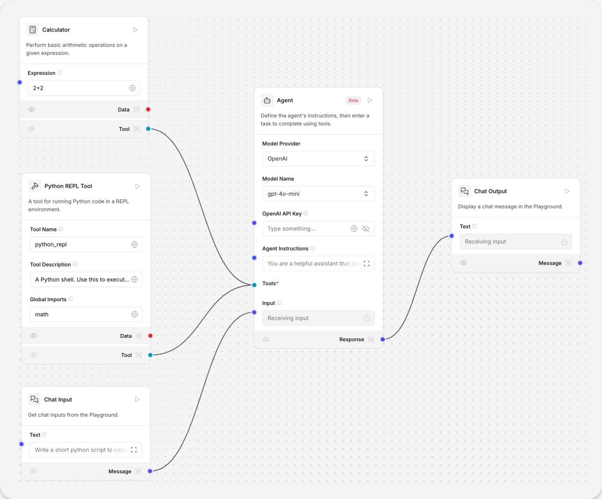
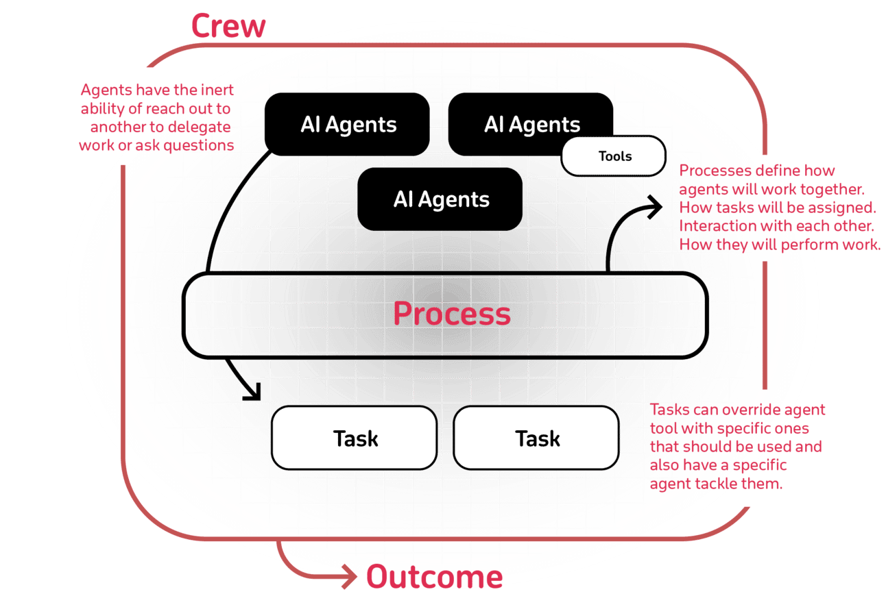

# Day 4: Tools and Frameworks for Building AI Agents

Hello again,

Welcome to Day 4 of our AI Agents journey! Over the past few days, we’ve looked at what AI Agents are, seen them in action through real-world use cases, and dissected their key architectural components.

Today, we’ll shift our focus to the practical side: which tools and frameworks can help you build these agents with greater ease and efficiency? As AI technology advances, a growing ecosystem of developer tools and platforms has emerged. Instead of reinventing the wheel, you can leverage these resources to rapidly prototype, scale, and maintain AI Agents that fit your unique business goals.

---

## Ways to Consume AI Agents

Depending on your expertise, time constraints, and business needs, you have several options:

### 1. Pre-Built Vertical Agents

Specialized agents are already out there, tailored to common tasks like customer support, marketing automation, or supply chain management. These “off-the-shelf” solutions let you start leveraging AI Agents immediately, with minimal customization needed. It’s a great way to get quick wins without heavy development work.

A good example (not sponsored) is [11x.ai](https://www.11x.ai/), which provides Sales, RevOps, and Go-To-Market AI Agents that act as digital workers delivering human results.

> Alice and Mike, off-the-shelf agents available from 11x.ai

---

### 2. No-Code Tools

No-code platforms allow you to build, configure, and deploy AI Agents using intuitive interfaces — dragging, dropping, and connecting components rather than writing code. These tools are perfect for non-technical users who still want to harness the power of AI Agents. It puts advanced capabilities in the hands of business analysts, product managers, and other stakeholders who may not have a coding background.

My favorite tool is **Langflow**, a visual framework for building multi-agent and RAG applications. It is open-source, Python-powered, fully customizable, and is LLM and vector store agnostic.

> Langflow visual interface to build AI Agents without coding

---

### 3. Developer Frameworks

For teams that need full control and customization, developer frameworks offer granular access to every part of your agent. With these tools, your engineering team can integrate advanced models, create complex decision logic, and fine-tune performance. While this requires more effort and technical know-how, it also unlocks the deepest level of flexibility and scalability.

---

## Popular Tools & Frameworks for AI Agent Development

- **CrewAI**  
  Cutting-edge framework for orchestrating role-playing, autonomous AI agents. CrewAI empowers agents to work together seamlessly by fostering collaborative intelligence, tackling complex tasks. Open-source developer experience is available on GitHub, which has more than 20k stars and a new enterprise version.

  A great way to start is the set of examples available in the repo: [crewAI-examples](https://github.com/crewAIInc/crewAI-examples)

  > CrewAI workflow (image from CrewAI.com)

- **LangGraph**  
  LangGraph provides a flexible framework for managing diverse control flows, including single-agent, multi-agent, hierarchical, and sequential setups, while reliably handling complex scenarios. It ensures agent reliability with built-in moderation and quality loops.

  The LangGraph Platform allows users to templatize cognitive architectures, making tools, prompts, and models easily configurable with its Platform Assistants.

  You can get started with the Quick Start Guide, complete with tutorials in Python.

  > LangGraph Multi-Agent Workflows (image from LangChain Blog)

- **LlamaIndex**  
  LlamaIndex is a framework for building context-augmented generative AI applications with LLMs, including agents and workflows. As part of it, you can build Agents for use cases such as Agentic RAG, Report Generation, Customer Support, or SQL Agents, among many others. They all come with samples in Python & TypeScript to help you get started.

- **Bee**  
  The Bee Agent Framework from IBM makes it easy to build scalable agent-based workflows with your model of choice. The framework is designed to perform robustly with Granite and Llama 3 models, and is actively being optimized for other popular LLMs.

  **Features:**
  - Use built-in tools or create your own in Javascript/Python.
  - **Code interpreter:** Run code safely in a sandbox container.
  - **Memory:** Multiple strategies to optimize token spend.
  - **Serialization:** Handle complex agentic workflows and easily pause/resume them without losing state.
  - **Instrumentation:** Use Emitter-based instrumentation for full visibility of your agent’s inner workings.
  - **Production-level control:** Caching and error handling.
  - **API:** Integrate your agents using an OpenAI-compatible Assistants API and Python SDK.
  - **Chat UI:** Serve your agent to users in a delightful UI with built-in transparency, explainability, and user controls.

- **AutoGen (Microsoft)**  
  There is also AutoGen from Microsoft, which is very impressive.

Choose the framework that best aligns with your team's skill level, business needs, and desired level of customization, with most frameworks eventually monetizing through premium features, enterprise support, and specialized modules.

---

## Choosing the Right Approach

When selecting tools, frameworks, and consumption models, consider:

- **Team Capabilities:** No-code solutions vs. engineer-centric frameworks.
- **Speed to Market:** Pre-built solutions vs. fully customized builds.
- **Scalability & Maintenance:** How easily will you update and grow your agent ecosystem?

By evaluating these factors, you can find the ideal path to quickly and effectively bring AI Agents into your operations—whether leveraging pre-built solutions for a rapid start or carefully crafting a custom agent ecosystem to meet complex, evolving business needs.

---

Tomorrow, we'll explore another exciting aspect of AI Agents. Stay tuned!

Best,  
Armand 🤓
