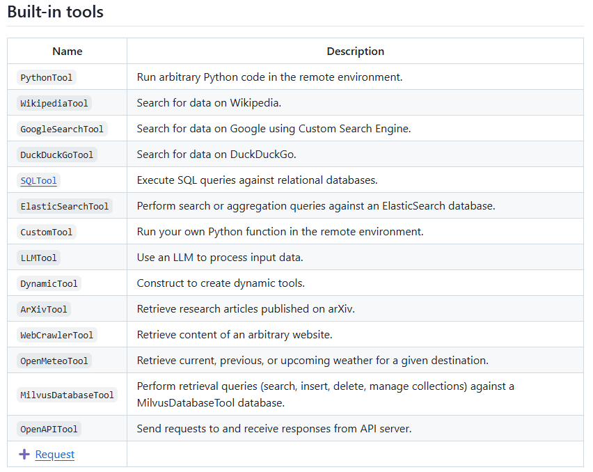

# Day 5: Integrating LLMs with AI Agents

Hello again,

Welcome to Day 5 of our AI Agents journey! Over the last few days, we explored the essential building blocks of AI Agents and the tools that make their development more accessible.

Today, we’ll focus on one of the most transformative technologies in this space: LLMs, and how they serve as the “brain” for your AI Agents.

---

## Why LLMs Matter for AI Agents

At their core, AI Agents need a way to understand context, interpret user input, and generate coherent responses. Traditionally, this required intricate rules or extensive domain-specific training. LLMs, however, have changed the game by providing a versatile and powerful language understanding layer that can adapt to various tasks with minimal tuning.

**By integrating an LLM into your agent’s architecture, you can:**

- **Enhance Language Understanding:**  
  LLMs can interpret subtle human language, handling complex queries and ambiguous user inputs far better than rule-based systems.

- **Personalize Interactions:**  
  With context-awareness and memory, your agent can tailor responses to individual users, reflect company-specific knowledge, and maintain consistent messaging over time.

- **Boost Reliability:**  
  As LLMs learn from vast and diverse datasets, they’re better equipped to handle edge cases and unexpected requests, reducing the need for constant manual updates.

> *Note: Most frameworks for building AI Agents are LLM-agnostic, meaning you can choose the LLM that best fits your performance, cost, and domain requirements.*

---

## How Integration Works

### Perception Through Language

Your agent sends raw user input — questions, commands, or descriptions— directly to the LLM. The LLM processes the input, interpreting intent, extracting key details, and returning a structured understanding for the agent to reason about.

### Reasoning & Planning

Once the LLM provides a rich linguistic and contextual interpretation, your agent’s reasoning components take over. With a stronger “mental model” provided by the LLM, the agent can weigh possible actions, recall relevant knowledge from memory, and draft a plan to achieve its goals.

### Action & Feedback Loop

The agent then executes its chosen actions. After receiving new data or user feedback, it queries the LLM again as needed, continually refining its understanding and improving the quality of its decisions.

> Overview of LLM-based AI agent (Image from researchgate.net)
>
> 

---

## The Importance of Function Calling

A key mechanism that makes LLMs even more powerful within AI Agents is function calling. Function calling allows your LLM to seamlessly integrate with external tools and APIs:

- **Structured Output:**  
  Instead of returning just free-form text, LLMs can respond with structured function calls—like a JSON object containing parameters. This ensures that outputs are machine-readable and reduces ambiguity, allowing your agent to parse results reliably and consistently.

- **Dynamic Behavior:**  
  With function calling, your agent can dynamically decide which external functions or APIs to use based on user queries. For example, if a user asks for today’s weather, the LLM can “call” the appropriate weather API automatically, retrieve fresh data, and incorporate it into its response.

- **Safe and Controlled Execution:**  
  By defining which functions are available to the agent, you control what actions the LLM can trigger. This creates a sandboxed environment where the LLM’s capabilities are guided and restricted, improving reliability, security, and safety.

> There’s a lot of innovation in the Tool Calling space, which will unlock real autonomous actions by AI and developers can easily create new tools to add into a catalog.

---

## Examples of Tools of One of the Frameworks

> 

Integrating function calling into your LLM-based agent transforms the agent from a passive respondent into an active problem-solver—one that not only processes language but also performs tasks and retrieves information on-demand.

---

## Which LLM is Best for Function Calling?

There is the **Berkeley Function-Calling Leaderboard** that evaluates the LLM’s ability to call tools accurately.

The **NPHardEval leaderboard** is another important benchmark for assessing the reasoning abilities of LLMs through the lens of computation complexity classes.

---

Tomorrow, we’ll explore Memory and Context Management, diving deeper into how agents maintain coherent, long-term interactions and retrieve the right information at the right time. By combining LLMs, function calling, and robust memory strategies, you’ll have the tools to create agents that truly understand and serve your business needs.

