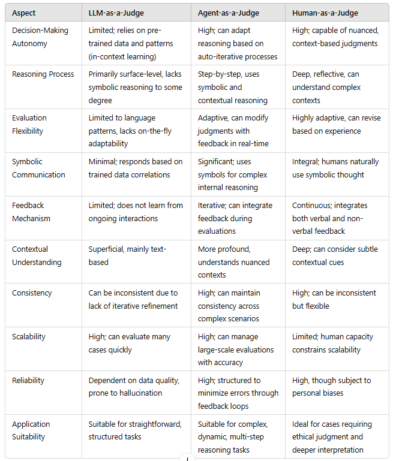

# Day 7: Evaluating and Measuring Agent Performance

Hello again,

As AI agents evolve from simple automation scripts into digital colleagues capable of planning, adapting, and improving over time, evaluating their performance becomes both crucial and challenging. Gone are the days of measuring success with a single metric or focusing on static benchmarks. Today’s AI agents must be measured across multiple dimensions—accuracy, efficiency, reliability, adaptability, and cost—to ensure they deliver real, sustained business value.

---

## A Major Problem with Agents

The rapid adoption of AI agents across industries—from healthcare to finance—has highlighted new measurement challenges. Unlike traditional software, AI agents:

- Exhibit behavior that varies with input complexity
- Can degrade subtly in performance over time
- Often require multi-dimensional success criteria

Without careful evaluation, organizations risk agent “drift” and missed opportunities. Proper metrics help determine where optimization is needed, justify continued AI investments, and ensure that these digital colleagues live up to their promise of efficiency and innovation.

---

## Four Key Types of Metrics for AI Agent Performance

1. **System Metrics:**  
   Focus on technical efficiency, resource consumption, and latency. Ensuring your agent runs smoothly, even at scale, prevents workflow bottlenecks and unnecessary costs.

2. **Task Completion:**  
   Assess whether agents achieve their assigned objectives, from completing claims processing steps to generating accurate tax audits. High task completion rates indicate that agents deliver consistent results without constant human oversight.

3. **Quality Control:**  
   Evaluate output quality, correctness, and adherence to standards. Quality control metrics catch subtle issues—like incomplete compliance checks or uneven formatting—before they erode trust.

4. **Tool Interaction:**  
   Monitor how well agents leverage external APIs, databases, and applications. Efficient and accurate tool usage is essential for agents that must dynamically retrieve information or automate multi-step workflows.

---

## Case Studies: Transforming AI Agents into Reliable Colleagues

1. **Advancing the Claims Processing Agent (Healthcare)**  
   A healthcare network’s claims processing agent struggled with reliability and compliance. By measuring LLM Call Error Rate, Task Completion Rate, Number of Human Requests, and Token Usage per Interaction, they identified critical inefficiencies and privacy risks. Optimizing these metrics led to faster claims processing, higher compliance accuracy, and reduced rejection rates.

2. **Optimizing the Tax Audit Agent (Accounting)**  
   A mid-sized accounting firm tackled lengthy audit times, high computing costs, and backlogged work. Metrics like Tool Success Rate, Context Window Utilization, and Steps per Task helped them adapt the agent’s analysis depth and context handling. Result: Faster audits, sharper discrepancy detection, and more efficient resource use.

3. **Elevating the Stock Analysis Agent (Finance)**  
   An investment firm struggled with redundant analyses and inconsistent report formats. Metrics such as Total Task Completion Time, Output Format Success Rate, and Token Usage per Interaction revealed how to tailor analysis depth and formatting to different roles. The outcome: More precise market insights and improved overall efficiency.

4. **Upgrading the Coding Agent (Software Development)**  
   A software company’s coding assistant caused disruptions and wasted resources. By focusing on LLM Call Error Rate, Task Success Rate, and Cost per Task Completion, they implemented standardized response templates, better error handling, and resource allocation strategies. The agent now provides more accurate code suggestions and optimizes infrastructure usage.

5. **Enhancing the Lead Scoring Agent (Sales)**  
   A B2B software firm’s sales team lost confidence in their lead scoring agent. Tracking Token Usage per Interaction, Latency per Tool Call, and Tool Selection Accuracy helped the agent adapt its analysis patterns, accelerate processing, and use the right tool for the right task. The result: Faster prospect qualification, higher accuracy, and better resource utilization.

---

## From Simple Metrics to Sophisticated Judging Paradigms

As we refine metrics, it’s also essential to consider who or what “judges” agent performance:

- **LLM-as-a-Judge:** Quick but surface-level evaluation based on pattern recognition. Useful for initial checks but may miss subtle, domain-specific nuances.
- **Agent-as-a-Judge:** Agents can evaluate each other using iterative, context-aware reasoning. This approach supports dynamic optimization and helps identify root causes of performance issues.
- **Human-as-a-Judge:** Involving human expertise adds depth, ethical oversight, and contextual interpretation. While not scalable for all tasks, human judgment ensures that AI-driven decisions align with business values and regulatory standards.

Combining these judging methods can balance automation efficiency with the depth of human intuition.

---
 
## Leveraging Frameworks and Tools for Evaluation

Evaluation doesn’t have to be built from scratch. Emerging frameworks, integrated development tools, and analytics platforms simplify the collection, visualization, and analysis of metrics. These solutions can:

- Automate performance logging and version tracking across development, staging, and production.
- Provide dashboards and reports that combine system metrics with business KPIs.
- Integrate with CI/CD pipelines, MLOps platforms, or analytics systems to unify evaluation efforts.
- Offer standardized interfaces for leveraging LLM or agent-based judges, easing experimentation and iteration.

By adopting these frameworks presented in past lessons, teams can seamlessly incorporate advanced evaluation techniques, ensuring their AI agents remain optimized, compliant, and strategically aligned with business goals.

> Agentic Evaluation module from Databricks (image from Databricks blog)
>
> 

---

## Key Lessons for the Future

- **Metric-Driven Optimization:** Align metrics with clear business outcomes to guide meaningful improvements.
- **Human Workforce Transformation:** As agents become more capable, human roles should shift towards oversight, strategy, and ethical guidance.
- **Outcome-Focused Target Setting:** Define what “success” means—better compliance, lower latency, improved customer satisfaction—and measure against these targets.
- **Continuous Improvement Cycles:** Regular measurement and refinement ensure agents adapt as conditions change.
- **Balanced Automation and Oversight:** AI agents should complement human intelligence, not replace it. Combine automated evaluation with human judgment for a holistic approach.

---

## Putting It All Together

Evaluating your AI Agent isn’t a one-time exercise—it’s an ongoing discipline. By combining quantitative metrics like accuracy and response time with qualitative measures like user feedback and business impact, you’ll gain a holistic view of how well your agent is performing. As you gather insights, feed them back into your development cycle, ensuring your agent evolves to meet new challenges, deliver better results, and maintain user trust.

Stay curious and keep refining your approach. Continuous evaluation is the secret to unlocking your AI Agent’s full potential.

Keep refining, and consider blending different judging frameworks as your agent’s role expands. Continuous evaluation, guided by the right perspectives and metrics, is the key to unlocking your AI Agent’s full potential.

Best,  
Armand 🤗
